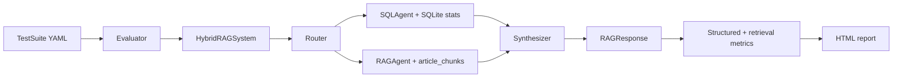

# rageval-nba

`rageval-nba` is a compact evaluation harness for hybrid RAG systems: systems
that must route each question to text retrieval, SQL, both paths, or a clean
refusal. The reference demo evaluates an NBA analytics assistant against a
handcrafted suite with structured stats, curated basketball-writing sources,
deterministic retrieval metrics, SQL checks, refusal checks, and calibrated
LLM-as-judge metrics.


## Why This Exists

Most RAG demos evaluate only vector retrieval or final-answer text. Production
systems are often hybrid: a question like "Who led the NBA in points per game?"
belongs in SQL, while "Why do analysts prefer true shooting percentage?" belongs
in retrieved writing, and "How do Jokic's stats support analyst claims about his
offense?" needs both. A useful evaluator has to measure routing, retrieval,
structured correctness, answer quality, and refusal behavior separately.

This project provides that end-to-end loop in a small NBA domain. The default
demo is deterministic and offline after setup: it builds a seed SQLite database,
loads a curated corpus manifest into `article_chunks`, runs the reference
`HybridRAGSystem`, and writes a screenshot-worthy HTML report.

The optional live path uses cached real NBA API payloads, sqlite-vec-backed
article retrieval, and Anthropic-backed routing/SQL/synthesis. It is only used
when the required API keys and local vector embeddings are available.

Latest live run, 2026-04-26: `rageval run examples/nba_test_suite.yaml --live
--verbose --no-cache` completed 42 cases in 231.01s with $0.197102 Anthropic
LLM cost, 0 overall errors, and 0 metric errors. Retrieval reached
`prefix_recall@5 = 0.780`, `prefix_ndcg@5 = 0.682`, and
`prefix_reciprocal_rank = 0.665`; refusal scored `1.000`. Live SQL equivalence
scored 12/12 = `1.000`, with 2 explicit skips for Basketball Reference-only
stats that are unavailable in the cached nba_api ingestion. Numeric tolerance
scored `0.625`.

## Quickstart

```bash
uv sync
uv run python scripts/build_stats_db.py
uv run python scripts/build_corpus.py --from-cache
uv run rageval demo --output demo-report.html
uv run rageval run examples/nba_test_suite.yaml --output report.html
```

Open `demo-report.html` for a 5-case smoke report or `report.html` for the full
42-case NBA suite. Generated reports, `data/nba.db`, raw fetched pages, and raw
cache files are gitignored.

If you rebuild `data/nba.db`, rebuild corpus chunks afterward:

```bash
uv run python scripts/build_corpus.py --from-cache
```

## What The Demo Includes

- 42 test cases across factual, analytical, hybrid, and
  unanswerable/adversarial categories.
- A deterministic seed NBA stats database for local demos and tests.
- A curated 40-source article manifest in `examples/corpus/articles.json`.
- A lexical fallback retriever over `article_chunks`; this is intentionally not
  production vector retrieval.
- A reference `HybridRAGSystem` with router, SQL path, RAG path, synthesizer, and
  clean refusal behavior.
- An HTML report with aggregate scores, route diagnostics, per-category
  breakdowns, highlighted failure modes, charts, SQL evidence, retrieved
  evidence, and per-case drilldowns.

## CLI

```bash
# Fast feedback: one representative sample per route/category.
uv run rageval demo --output demo-report.html --verbose

# Full NBA suite.
uv run rageval run examples/nba_test_suite.yaml --output report.html

# Force deterministic offline mode.
uv run rageval run examples/nba_test_suite.yaml --output report.html --offline

# Live mode: requires ANTHROPIC_API_KEY, OPENAI_API_KEY, real stats, and embeddings.
uv run python scripts/build_stats_db.py --mode real --resume-raw
uv run python scripts/build_corpus.py --from-cache
uv run python scripts/build_corpus.py --embed
uv run rageval run examples/nba_test_suite.yaml --output report.html --live --verbose

# Run a deterministic metric subset.
uv run rageval run examples/nba_test_suite.yaml \
  --output report.html \
  --metrics refusal,prefix_recall@5

# Deterministic routing calibration; no API key required.
uv run rageval calibrate routing --threshold 0.8
```

`rageval run` also supports `--max-cases`, repeated `--metrics`, `--verbose`,
`--offline`, `--live`, and `--no-cache`. If both `ANTHROPIC_API_KEY` and
`OPENAI_API_KEY` are present, the CLI defaults to live mode; otherwise it uses
the deterministic offline path. `--offline` always forces the fixture-backed
path. `--no-cache` bypasses the Anthropic cache for live LLM calls and
calibration.

## Metrics Explained

| Metric | Applies To | What It Checks |
| --- | --- | --- |
| `numeric_tolerance` | Factual cases with `expected_numeric` | Extracts numbers from the answer and checks tolerance. |
| `sql_equivalence` | Cases with `expected_sql_rows` or live `live_expected_sql_rows` | Compares SQL rows; hybrid cases allow expected rows as a subset. Live mode uses verified real-DB expectations and skips stats not present in nba_api. |
| `refusal` | All cases | Verifies the system refuses exactly when `should_refuse` is true. |
| `prefix_precision@5` | Cases with `relevant_doc_ids` | Fraction of top-5 retrieved chunks whose article ID prefix is relevant. |
| `prefix_recall@5` | Cases with `relevant_doc_ids` | Fraction of relevant article prefixes reached in top-5 retrieval. |
| `prefix_ndcg@5` | Cases with `relevant_doc_ids` | Rank-aware retrieval quality over article ID prefixes. |
| `prefix_reciprocal_rank` | Cases with `relevant_doc_ids` | Reciprocal rank of the first relevant article-prefix match. |
| `faithfulness` | LLM judge calibration / optional use | Whether answer claims are supported by retrieved evidence. |
| `relevance` | LLM judge calibration / optional use | Whether an answer directly addresses the question. |
| `correctness` | LLM judge calibration / optional use | 0-4 answer correctness with position-swap mitigation. |
| `routing` | Calibration / route checks | Whether routing decision matches the labeled question type. |

Skipped metric cells in the report are not failures; they mean the metric is not
applicable for that case.

## Architecture



## Calibration Results

Live judge calibration was recorded on 2026-04-26 with
`claude-haiku-4-5-20251001`. See
[`docs/judge_calibration.md`](docs/judge_calibration.md) for method details,
fixtures, prompt notes, and correctness position-swap evidence. Prompt-history
notes live in [`docs/prompt_evolution.md`](docs/prompt_evolution.md).

| Judge | Agreement | Threshold | Status |
| --- | ---: | ---: | --- |
| Faithfulness | 100% (10/10) | >= 80% | PASS |
| Relevance | 100% (10/10) | >= 80% | PASS |
| Correctness | 80% (8/10) | >= 80% | PASS |
| Routing | 100% (10/10) | >= 80% | PASS, deterministic |

## LLM-as-Judge Caveats

LLM judges are useful because they scale qualitative checks such as
faithfulness, relevance, and answer correctness, but they are not ground truth.
They can show position bias, verbosity bias, prompt sensitivity, and plausible
reasoning that still reaches the wrong score. `CorrectnessJudge` mitigates one
known issue by scoring the candidate/reference order twice and surfacing
`forward_score`, `swapped_score`, `disagreement`, and `disagreement_flag`.

This design follows the same caution raised by Zheng et al. 2023,
["Judging LLM-as-a-Judge with MT-Bench and Chatbot Arena"](https://arxiv.org/abs/2306.05685):
LLM-as-judge can approximate human preference at useful agreement rates, but it
must be calibrated, measured, and treated as a signal rather than an oracle.

## Data And Corpus Notes

The tracked corpus source list is `examples/corpus/articles.json`. It contains
metadata, source URLs, topics, storage policies, and short repo-authored
summaries where needed. Raw fetched pages are intentionally not tracked:
`scripts/build_corpus.py --fetch` writes them under the gitignored
`data/raw/corpus/` cache, and `--from-cache` builds local SQLite rows.

Vector retrieval uses `text-embedding-3-small` at 1024 dimensions so embeddings
fit the existing sqlite-vec `chunk_embeddings` schema. The model was chosen
because it is inexpensive for a small corpus, supports custom dimensions, and
can be called with the existing `httpx` dependency. Before making embedding API
calls, `scripts/build_corpus.py --embed` estimates cost and aborts if it exceeds
the default `$1` ceiling. Without `OPENAI_API_KEY` or sqlite-vec, the project
keeps using deterministic lexical retrieval.

Real NBA API ingestion is available, but the default demo uses seed mode to
avoid timeouts and rate limits:

```bash
uv run python scripts/build_stats_db.py --mode real --resume-raw \
  --timeout-seconds 30 --rate-limit-seconds 1
```

Live Anthropic-backed judge calibration requires `ANTHROPIC_API_KEY`. The
deterministic routing judge does not.

## Local Package Readiness

The package exposes the `rageval` console script and includes the Jinja report
template plus a bundled demo suite resource so `rageval demo` does not depend on
a repo-root `examples/` directory. The project is intended to run from a cloned
repo with `uv sync`; `uv build` is used as a local packaging sanity check to
verify templates and bundled demo resources are included correctly.

## Roadmap

- Tag `v0.1.0` and attach local build artifacts to a GitHub release if desired.
- Record a 90-second demo video scrolling through the report.
- Add optional vector retrieval when embeddings/sqlite-vec are available.
- Add hosted sample report or GitHub Pages preview.
- Broaden examples beyond NBA once the evaluation API stabilizes.
