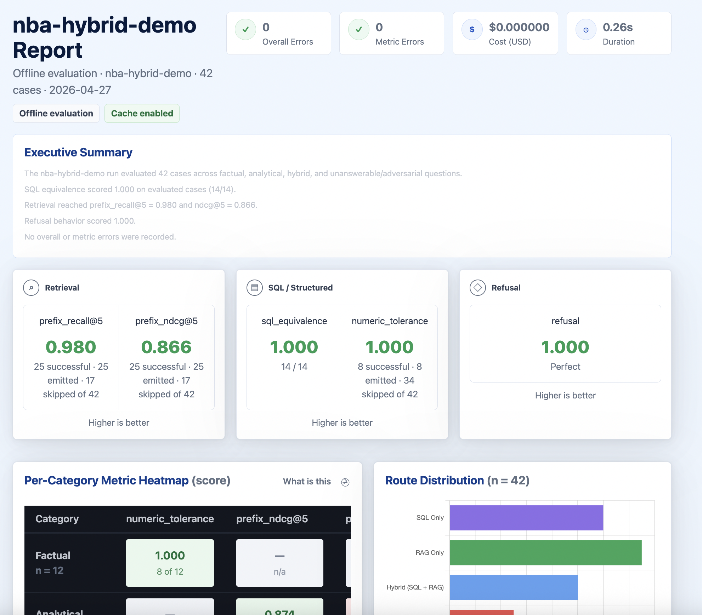
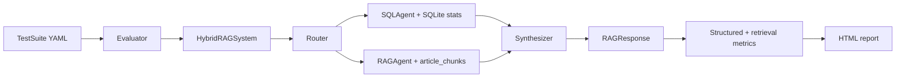

# rageval-nba

`rageval-nba` is a compact evaluation harness for **hybrid RAG systems** — systems
that must route each question to text retrieval, SQL, both, or a clean refusal.
The reference demo evaluates an NBA analytics assistant against a 42-case
handcrafted suite covering structured stats, curated basketball-writing sources,
deterministic retrieval metrics, SQL row checks, refusal checks, and three
calibrated LLM-as-judge metrics.



## Why this exists

Most RAG demos evaluate only vector retrieval or final-answer text. Production
systems are often hybrid: a question like *"Who led the NBA in points per
game?"* belongs in SQL, *"Why do analysts prefer true shooting percentage?"*
belongs in retrieved writing, and *"How do Jokić's stats support analyst claims
about his offense?"* needs both. A useful evaluator has to measure routing,
retrieval, structured correctness, answer quality, and refusal behavior
**separately**.

## What you get out of the box

A reference `HybridRAGSystem` (router → SQL or RAG or both → synthesizer →
refusal) wired to a SQLite stats database and a 40-source article corpus. The
`Evaluator` runs a YAML test suite of 42 cases against it, scores each case on
the applicable metrics, and writes a single HTML report with
aggregate scores, route diagnostics, per-category heatmap, highlighted failure
modes, and a per-case drilldown for every question (model answer, SQL evidence,
retrieved chunks, per-metric tiles).

## Latest live run

> **2026-04-26** with `claude-haiku-4-5-20251001`. Numbers are historical and
> not guaranteed across model, cache, or data changes. Reproduce with
> `uv run rageval run examples/nba_test_suite.yaml --live --verbose --no-cache`.

| Metric | Value |
| --- | ---: |
| Cases evaluated | 42 |
| Wall-clock duration | 206.00 s |
| Anthropic LLM cost | $0.200850 |
| Overall errors | 0 |
| Metric errors | 0 |
| `prefix_recall@5` | 0.820 |
| `prefix_ndcg@5` | 0.698 |
| `prefix_reciprocal_rank` | 0.673 |
| `refusal` | 1.000 |
| `sql_equivalence` (live) | 10 / 12 = 0.833 |
| `numeric_tolerance` | 0.625 |

Live `sql_equivalence` is scored against `live_expected_sql_rows` (rows verified
against the cached real database) and skips Basketball Reference-only stats
that `nba_api` does not expose.

## Quickstart

```bash
uv sync
uv run python scripts/build_stats_db.py
uv run python scripts/build_corpus.py --from-cache
uv run rageval demo --output demo-report.html --offline
uv run rageval run examples/nba_test_suite.yaml --output report.html --offline
```

Open `demo-report.html` for a 5-case deterministic fixture smoke report or
`report.html` for the full 42-case fixture suite. This mode proves evaluator,
metric, and report plumbing; live mode exercises the real LLM/router/SQL/vector
components. Generated reports, `data/nba.db`, raw fetched pages, and the LLM
cache are gitignored.

## CLI

```bash
# Fast deterministic fixture feedback: one representative sample per route/category.
uv run rageval demo --output demo-report.html --offline --verbose

# Full deterministic fixture NBA suite.
uv run rageval run examples/nba_test_suite.yaml --output report.html --offline

# Run a deterministic metric subset.
uv run rageval run examples/nba_test_suite.yaml \
  --output report.html --offline \
  --metrics refusal,prefix_recall@5

# Deterministic routing calibration; no API key required.
uv run rageval calibrate routing --threshold 0.8

# Live mode: requires ANTHROPIC_API_KEY, OPENAI_API_KEY, real stats, embeddings.
uv run python scripts/build_stats_db.py --mode real --resume-raw
uv run python scripts/build_corpus.py --from-cache
uv run python scripts/build_corpus.py --embed
uv run rageval run examples/nba_test_suite.yaml --output report.html --live --verbose
```

`rageval run` also supports `--max-cases N` and `--no-cache`. If both
`ANTHROPIC_API_KEY` and `OPENAI_API_KEY` are present, the CLI defaults to live
mode; otherwise it uses the deterministic fixture demo path. `--offline` always
forces suite-labeled routing, canned/demo SQL branches, and lexical retrieval.
`--no-cache` bypasses the Anthropic disk cache for live LLM calls and
calibration. Live reports surface vector fallback warnings if vector retrieval
degrades to lexical retrieval. After rebuilding `data/nba.db` you must rerun
`scripts/build_corpus.py --from-cache` (and `--embed` for live mode) to
repopulate `article_chunks` and `chunk_embeddings`.

## Architecture



In **live mode**, Router/SQLAgent/Synthesizer are Anthropic-backed and the
RAG agent uses sqlite-vec ([src/rageval/cli.py:546-557](src/rageval/cli.py#L546-L557)).
In **deterministic fixture demo mode** (`--offline`), the same boxes are
stand-ins: `_SuiteRouter` reads the labeled `question_type`, `_DemoSQLAgent`
returns canned SQL keyed by question substring, and the synthesizer stitches a
fixed-format answer from the SQL rows and retrieved chunks
([src/rageval/cli.py:791-903](src/rageval/cli.py#L791-L903)).
The metrics, evaluator, and report are identical across both modes.

The live SQL agent's prompt encodes NBA league-leader qualification rules — for
example, points-per-game / scoring-title queries require `games_played >= 58`
unless the user explicitly asks for raw unqualified leaders. See
[`prompts/sql_agent/v3.txt`](prompts/sql_agent/v3.txt).

## How it scores

Each test case is run against the system, then every applicable metric is
evaluated against the response. Metrics group into four families: routing
(does the system pick the right path?), retrieval (4 prefix-aware IR metrics
on `article_chunks`), structured correctness (SQL row equivalence and numeric
tolerance), and refusal. Three additional LLM-as-judge metrics — faithfulness,
relevance, correctness — are calibrated separately and available on demand.

| Metric | Applies To | What It Checks |
| --- | --- | --- |
| `numeric_tolerance` | Factual cases with `expected_numeric` | Extracts numbers from the answer and checks tolerance. |
| `sql_equivalence` | Cases with `expected_sql_rows` or live `live_expected_sql_rows` | Compares SQL rows; hybrid cases allow expected rows as a subset. Live mode uses verified real-DB expectations and skips stats not present in nba_api. |
| `refusal` | All cases | Verifies the system refuses exactly when `should_refuse` is true. |
| `prefix_precision@5` | Cases with `relevant_doc_ids` | Fraction of top-5 retrieved chunks whose article ID prefix is relevant. |
| `prefix_recall@5` | Cases with `relevant_doc_ids` | Fraction of relevant article prefixes reached in top-5 retrieval. |
| `prefix_ndcg@5` | Cases with `relevant_doc_ids` | Rank-aware retrieval quality over article ID prefixes. |
| `prefix_reciprocal_rank` | Cases with `relevant_doc_ids` | Reciprocal rank of the first relevant article-prefix match. |
| `faithfulness` | LLM judge calibration / optional use | Whether answer claims are supported by retrieved evidence. |
| `relevance` | LLM judge calibration / optional use | Whether an answer directly addresses the question. |
| `correctness` | LLM judge calibration / optional use | 0–4 answer correctness with position-swap mitigation. |
| `routing` | Calibration / route checks | Whether routing decision matches the labeled question type. |

Skipped metric cells in the report are not failures — they mean the metric is
not applicable for that case. Live `sql_equivalence` falls back to
`live_expected_sql_rows` because the cached `nba_api` database does not always
match the deterministic seed fixtures, and Basketball Reference-only metrics
(`player_efficiency_rating`, `win_shares`, `box_plus_minus`, `vorp`) are
skipped instead of scored against placeholders.

## Calibration

Live judge calibration was recorded on 2026-04-26 with
`claude-haiku-4-5-20251001`. See
[`docs/judge_calibration.md`](docs/judge_calibration.md) for method details,
fixtures, prompt notes, and correctness position-swap evidence. Prompt-history
notes live in [`docs/prompt_evolution.md`](docs/prompt_evolution.md). Each
fixture is `n=10` — enough to catch gross failures but not a tight statistical
estimate.

| Judge | Agreement | Threshold | Status |
| --- | ---: | ---: | --- |
| Faithfulness | 100% (10/10) | ≥ 80% | PASS |
| Relevance | 100% (10/10) | ≥ 80% | PASS |
| Correctness | 80% (8/10) | ≥ 80% | PASS |
| Routing | 100% (10/10) | ≥ 80% | PASS, deterministic |

Live Anthropic-backed judge calibration requires `ANTHROPIC_API_KEY`. The
deterministic routing judge does not.

## LLM-as-judge caveats

LLM judges are useful because they scale qualitative checks such as
faithfulness, relevance, and answer correctness, but they are not ground truth.
They can show position bias, verbosity bias, prompt sensitivity, and plausible
reasoning that still reaches the wrong score. `CorrectnessJudge` mitigates one
known issue by scoring the candidate/reference order twice and surfacing
`forward_score`, `swapped_score`, `disagreement`, and `disagreement_flag`.
LLM-as-judge can approximate human preference at useful agreement rates, but it
must be calibrated, measured, and treated as a signal rather than an oracle.

## What's in the suite

The 42 cases in [`examples/nba_test_suite.yaml`](examples/nba_test_suite.yaml)
break down as 12 factual, 15 analytical, 10 hybrid, and 5
unanswerable/adversarial. One example per category:

- **Factual** (`factual-002`): *"What was Nikola Jokić's true shooting
  percentage in 2022-23?"* — scored by `numeric_tolerance` against `0.701` and,
  in live mode, by `sql_equivalence` against the real-DB row.
- **Analytical** (`analytical-001`): *"What are the 'four factors' in
  basketball analytics?"* — scored by the four `prefix_*@5` retrieval metrics
  against three relevant `article_chunks` IDs.
- **Hybrid** (`hybrid-001`): *"Jokić is often called a historic offensive
  talent. What do the stats support this and how do analysts describe his
  game?"* — scored by both `sql_equivalence` (containment match) and
  retrieval metrics.
- **Adversarial** (`adversarial-001`): *"Who will win MVP in the 2027-28
  season?"* — `should_refuse: true`, scored by `refusal`.

## Data and corpus notes

The tracked corpus source list is
[`examples/corpus/articles.json`](examples/corpus/articles.json) — 40 entries
with metadata, source URLs, topics, and storage policies. 14 of the 40 carry
short repo-authored summaries; the rest are URL + metadata only, because
redistributing copyrighted article text is unsafe. Raw fetched pages are
intentionally not tracked: `scripts/build_corpus.py --fetch` writes them under
the gitignored `data/raw/corpus/` cache, and `--from-cache` builds local
SQLite rows.

The default `data/nba.db` is built by `scripts/build_stats_db.py` (seed mode,
fast and offline). Real ingestion from `nba_api` is available via
`--mode real --resume-raw`; the deterministic fixture demo then runs against
whichever DB happens to be at `data/nba.db`. Real ingestion is rate-limited:

```bash
uv run python scripts/build_stats_db.py --mode real --resume-raw \
  --timeout-seconds 30 --rate-limit-seconds 1
```

Vector retrieval uses `text-embedding-3-small` at 1024 dimensions to fit the
existing sqlite-vec `chunk_embeddings` schema. The model was chosen because it
is inexpensive for a small corpus, supports custom dimensions, and can be
called with the existing `httpx` dependency. Before making embedding API
calls, `scripts/build_corpus.py --embed` estimates cost and aborts if it
exceeds the default `$1` ceiling. Without `OPENAI_API_KEY` or sqlite-vec, the
project keeps using deterministic lexical retrieval.

## Known limitations

- The "Latest live run" numbers are historical (2026-04-26). Future model,
  cache, or data changes can shift them.
- The article corpus tracks only metadata + URLs for 26 of 40 sources. The
  remaining 14 carry repo-authored summaries — useful for retrieval matching
  but not full article text.
- Deterministic fixture demo mode uses lexical-overlap retrieval, not production
  vector search. Vector retrieval is opt-in via `OPENAI_API_KEY` + sqlite-vec,
  used by default in live mode.
- Calibration sets are `n=10` per judge. Treat the 80% / 100% numbers as
  smoke checks, not as tight statistical estimates.
- The deterministic fixture path uses substring-keyed canned SQL (see
  `_DemoSQLAgent` in [src/rageval/cli.py](src/rageval/cli.py)). It exercises
  the metrics and reporting pipeline but does not test the live SQL agent's
  prompt, which is the path used in live mode.

## Roadmap

- Add hosted sample report or GitHub Pages preview.
- Broaden examples beyond NBA once the evaluation API stabilizes.
- Surface expected-vs-actual answers/SQL inline in the report drilldown.
- Render Wilson confidence intervals next to aggregate metric scores.

## License

MIT — see [`LICENSE`](LICENSE).
